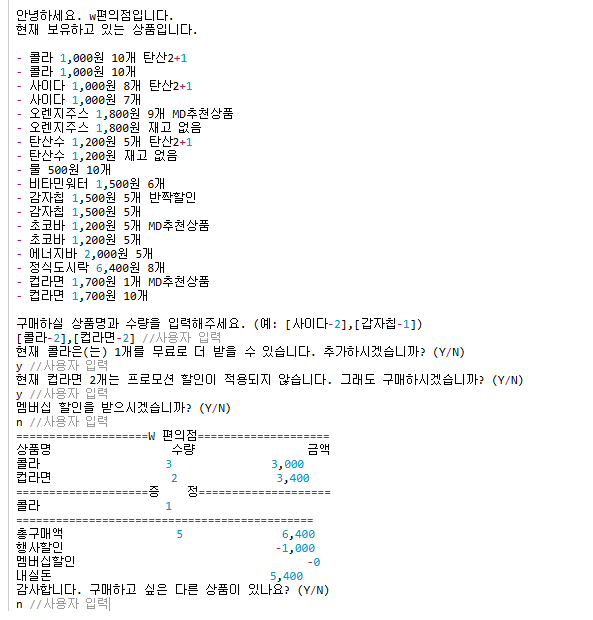

# java-convenience-store-precourse

## 편의점 소개

#### 설명

재고에 따른 원하는 상품을 주문할 수 있다. 프로모션이 적용되는 상품이 존재하고, 멤버쉽 할인도 받을 수 있다.
  

#### 사용법

1. 구매할 상품과 수량을 입력한다.

    * 상품명, 수량은 하이픈(-)으로, 개별 상품은 대괄호([])로 묶어 쉼표(,)로 구분한다. ex)[콜라-10],[사이다-3]
    * 상품명은 영어&한글로만 이루어져야함
    * 공백을 허용하지 않음

2. 프로모션 상품인 경우
    * 이후 모든 입력은 Y/N으로 답한다.
        * 공백을 허용하지 않음.
        * 소문자, 대문자의 구분 없음.

2-1. 프로모션 적용이 가능한 상품에 대해 해당 수량보다 적게 가져온 경우, 그 수량만큼 추가 여부를 입력한다.  
2-2. 프로모션 재고가 부족하여 일부 수량을 프로모션 혜택 없이 결제해야 하는 경우, 일부 수량에 대해 정가로 결제할지 여부를 입력한다. 

3. 멤버쉽 할인 적용 여부를 입력한다. (멤버쉽은 프로모션 미적용 상품에 대해서만 적용된다)
4. 영수증이 출력되고,추가 구매 여부를 입력 한다.

#### 사용 예시

 사용 예시 사진

---

## 기능 목록

### View

#### InputView

1. 구매 상품 및 수량 입력
2. 구매 수량 부족으로 인한 프로모션 미적용시 추가 구매 여부 입력
3. 프로모션 재고 부족으로 인한 일부 수량 정가 결제 여부 입력
4. 멤버십 할인 적용 여부 입력
5. 영수증 출력 후 추가 구매 여부 입력

#### OutputView

1. 재고 출력
2. 영수증 출력(구매 상품 내역/증정 상품 내역/ 금액 정보)

 

### InputValidation Class (입력 에러 처리 용도)

View 에서 들어온 입력이 유효한 입력인지 검사하는 클래스이다. (아래 넘버링은 View 기능의 넘버링을 따름)

0.0 (공통) null 체크  
0.1. y /n 으로 입력됐는지 체크  

1-1. 양식 맞는지 확인 [상품-숫자]  
1-2. LinkedHashMap 형태로 바꿔서 정보 전달  

### Controller

#### Controller

1. 상품 정보 출력 및 구매 목록 입력받기 흐름 제어
2. 프로모션 진행 및 계산 흐름 제어
3. 구매 가능 여부 확인 (상품 수량 확인 - 전체 수량에 대해 가능한지 // 상품 존재 여부 확인)
4. 프로모션 상품인지 확인
5. 멤버쉽 할인 진행

### Model

#### ReadMarkdown Class

1. 프로모션 파일 정보 읽어오기
2. 상품 정보 파일 읽어오기
3. 상품 리스트 반환

#### Product Class

1. 주어진 클래스에 getter 추가
2. 동일한 상품인지 확인하는 함수
3. 프로모션만 존재하는 상품에 대해 일반 재고 product(수량 =0) 으로 추가하기

#### Promotion Class

1. 프로모션에 해당하는 날짜인지 확인

#### ProductManager Class

1. 주문한 상품이 상품 리스트에 존재하는지 확인
2. 주문한 양만큼의 전체 수량이 존재하는지 확인
3. 상품에 대해 프로모션 존재 여부 확인
4. 프로모션 재고와 일반 재고 수량 비교

#### ErrorMessage Enum Class

에러 메시지들을 담아놓은 상수 클래스

### 스스로 제한한 상황

- 중복 주문 불가능 [사이다-1] [사이다-2]
- 수량은 무조건 양수여야 함 (int 범위)
- 메뉴이름은 영어+한글만 가능함
- 모든 입력은 공백을 포함하면 안됨